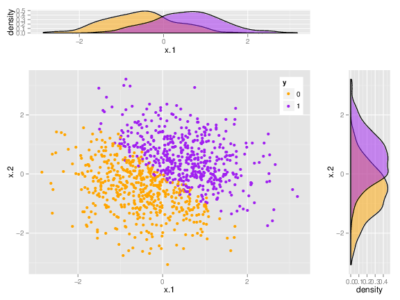

In their recent, high-impact, [PNAS publications](http://www.pnas.org/content/112/50/15468.abstract), a Tel Aviv University research group led by [Prof. Daphna Joel](http://people.socsci.tau.ac.il/mu/daphnajoel/) claims that no difference exists between male and female brain. 
This was a very high profile study as can be seen by the mentions in 
[The New Scientists](https://www.newscientist.com/article/dn28582-scans-prove-theres-no-such-thing-as-a-male-or-female-brain/), 
[TheGuardian](https://www.theguardian.com/science/2015/dec/01/brain-sex-many-ways-to-be-male-and-female),
[MedicalPress](http://medicalxpress.com/news/2015-11-male-female-brain-valid-distinction.html),
[IsraelScienceInfo](http://www.israelscienceinfo.com/en/medecine/femmes-et-sciences-pour-luniversite-de-tel-aviv-les-cerveaux-feminins-et-masculins-sont-un-patchwork-de-caracteristiques/),
[DailyMail](http://www.dailymail.co.uk/sciencetech/article-3340123/Male-vs-female-brain-Not-valid-distinction-study-says.html), 
[TheJerusalemPost](http://www.jpost.com/Business-and-Innovation/Health-and-Science/TAU-neuroscientists-Brains-are-not-gendered-435882), 
[CBCNews](http://www.cbc.ca/news/technology/brain-sex-differences-1.3344954), and many more. 

This publications contradicts much of the corpus of knowledge on brains and gender, and thus took the scientific community by surprise. How can this be?

In short and as put by Carl Sagan: 
"__Absence of evidence is not evidence of absence__". 

Indeed, by performing many univariate analyses, the authors show that males and females do not  any particular pattern in the brains' structure, as least as recorded by MRI scans.
It is, however, quite possible for two multivariate data sets to be nicely separated, but not so in any of the "raw" univariate measurements. 
The following figure is a toy example of a dataset which cannot be separated by any single (raw) variable, but certainly can when considering two variables simultaneously. 

  
 
 I suspect this is what happened in the case of "Sex Beyond the Genitalia". When I reanalyzed the same data the __multivariate__ brain structures of males and females was different enough, so that the gender could be inferred from the MRI data alone, with $~ 80\%$ accuracy(!). 

En passant I will note that if you are interested in the concept of using a classifier for testing hypotheses (as I did) then you should definetly read [Aaditya, Singh and Wasserman](http://arxiv.org/abs/1602.02210).