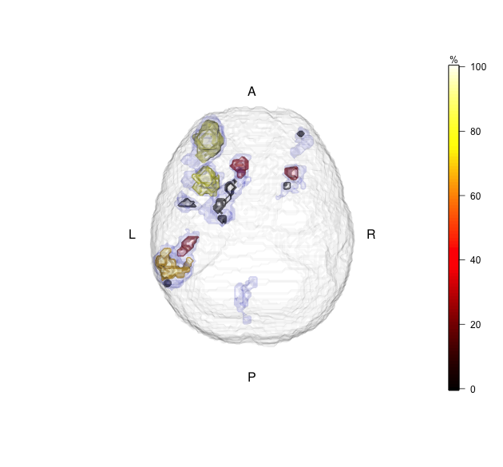

The most prevalent mode of inference in brain imaging is inference on supra-threshold clusters, with random field theory providing error guarantees. 
This introduces a _spatial specificity paradox_. The larger the detected cluster, the less we know on the exact location of the activation. This is because the null hypothesis tested is "no activation in the whole cluster" so the alternative is "at least on voxel is active in the cluster". This observation is now new, but merely an implication of the random field assumption. 

To deal with this paradox, we propose to estimate the amount of active voxels in the cluster. If this proportion is large, then there is no real paradox. If this proportion is small, we may want to "drill down" to sub-clusters. This introduces a circularity problem, a.k.a. selective inference: we are not making inference on arbitrary voxels, but rather, voxels that belong to statistically significant clusters. 

In the spirit of the FDR, we call the proportion of active voxels in a cluster the _True Discovery Proportion_ (TDP). We use recent results from the multiple testing literature, namely the _All Resolution Inference_ (ARI) framework of Goeman and other [1,2], to estimate the TDP in selected clusters. 

The ARI framework has many benefits for our purpose:

1. It takes voxel-wise p-values and returns TDP lower bounds. 
1. The algorithm is very fast, as implemented in the [hommel](https://cran.r-project.org/package=hommel) R package. 
1. For brain imaging, we wrote a wrapper package, _ARIbrain_, soon to be published in CRAN.
1. The TDP bounds using ARI come with statistical error guarantees. Namely, with probability $1-\alpha$ (over repeated experiments), no cluster will have an over estimated TDP. 
1. The above guarantee applies no matter how clusters have been selected. 

The last item has quite surprising implications. 
It means that ARI provides statistical guarantees if selecting clusters and estimating TDP from the same data, and particularly if clusters are selected using random-field-theory significance tests. 
It also means that one may create sub-clusters within significant clusters, and estimate TDP again, without losing error guarantees(!).
It also means that one may select clusters using the TDP itself, and if unsatisfied with results, re-select clusters using which ever criterion, ad infinitude.

Here is an example of PTD bounds in sub-clusters, within the originally selected clusters: .

How does this re-selection not invalidate error guarantees? 
Put differently, how does ARI deal with this __infinite circularity__?
The fundamental idea is similar to [Scheffe's method](https://en.wikipedia.org/wiki/Scheff%C3%A9%27s_method) in post-hoc inference. 
The idea is to provide statistical guarantees on TDP to __all possible cluster selection__. This means that any cluster a practitioner may create, has already been accounted for by the ARI algorithm.

Providing valid lower TDP bounds is clearly not the only task at hand. 
Indeed, bounding all TDP's at $0$ satisfied the desired error guarantees, for all possible cluster selection. 
The real matter is power: are the TDP bounds provided by ARI tight, given the massive number of implied clusters being considered? 
The answer is that the TDP bounds are indeed tight, at least in large clusters where the spatial specificity paradox is indeed a concern. 

Two fundamental ingredients allow ARI to provide informative TDP bounds, even after this infinitely circular inference. 
The first ingredient, is that we do not consider all possible brain maps, but rather, we assume the the brain map is __smooth enough__. 
This smoothness is implied by assuming that the brain map satisfies the _Simes Inequality_, which excludes extremely oscillatory brain maps, which would require more conservative bounds. 
The Sims inequality is implied by the _Positive Regression Dependence on Subsets_ condition, which is frequently used in brain imaging, since it is required for [FDR control](https://en.wikipedia.org/wiki/False_discovery_rate) using the [Benjamini-Hochberg](https://en.wikipedia.org/wiki/False_discovery_rate#Benjamini%E2%80%93Hochberg_procedure) algorithm. 

The second ingredient, is that the TDP bounds are provided by inverting a [closed testing procedure](https://en.wikipedia.org/wiki/Closed_testing_procedure), which is a powerful algorithm for multiple testing correction.

The compounding of a closed testing procedure in a smooth-enough random field, implies that the true TDP cannot be too far from the observed TDP, so that it may be bound while being both informative, and statistically valid. 

The full details can be found in our recent contribution, now accepted to Neuroimage [3].

-----  
[1] Goeman, Jelle, et al. "Simultaneous Control of All False Discovery Proportions in Large-Scale Multiple Hypothesis Testing." arXiv preprint arXiv:1611.06739 (2016).

[2] Goeman, Jelle J., and Aldo Solari. "Multiple testing for exploratory research." Statistical Science 26.4 (2011): 584-597.

[3] Rosenblatt, J. D., Finos, L., Weeda, W. D., Solari, A., & Goeman, J. J. (2018). All-Resolutions Inference for brain imaging. NeuroImage.
