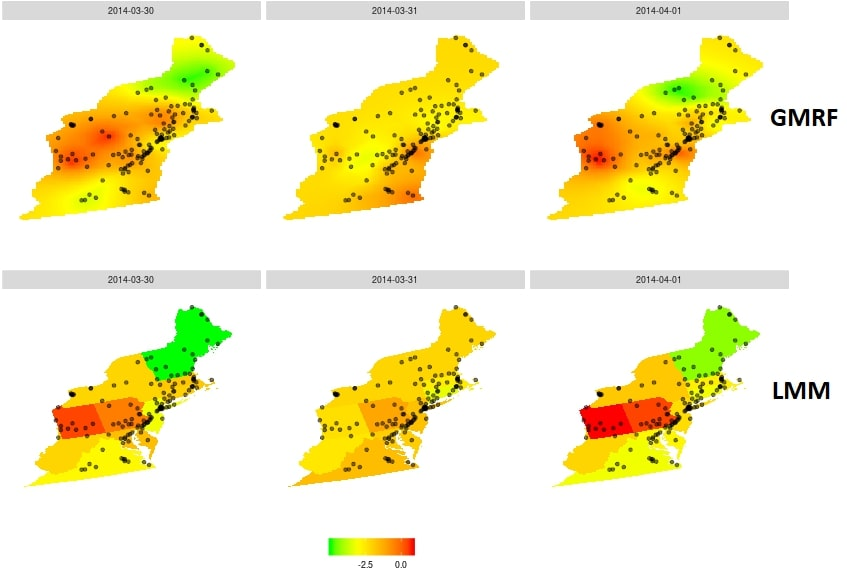
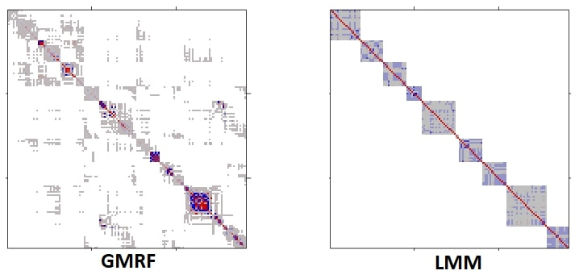
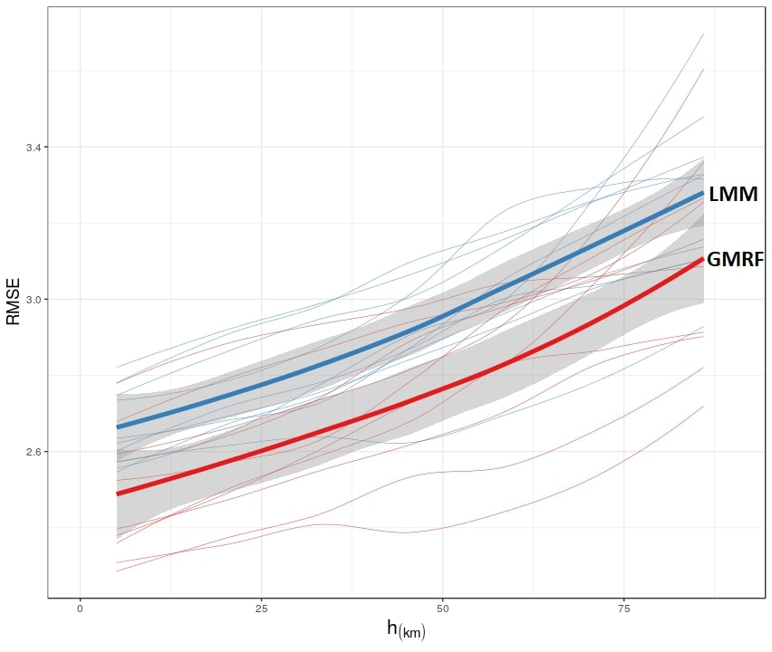

It was [Prof. Itai Kloog](http://in.bgu.ac.il/en/humsos/geog/Pages/staff/kloog.aspx) that introduced us to the problem of pollution assessment. 
In short: pollution is assessed from satellite imagery, calibrated from ground monitoring stations. 
In statistical parlance: we predict pollution using image quality ([AOD](https://earthobservatory.nasa.gov/global-maps/MODAL2_M_AER_OD)) as a predictor.

How to fit a predictive model?
In particular, given the spatial correlation in the model's errors.

First approach: __A Gaussian Random Field__. 
In particular, with an assumed [Matern Covariance Function](https://en.wikipedia.org/wiki/Mat%C3%A9rn_covariance_function). 
This is a standard approach in spatial statistics. 
Predictions that account for covariance in errors are known by statisticians as [BLUPs](https://en.wikipedia.org/wiki/Best_linear_unbiased_prediction), by applied mathematicians as Linear Projection Operators, by Geostatisticians as [Kriging](https://en.wikipedia.org/wiki/Kriging), and by Numerical Analysts as [Radial Basis Functions Interpolator](https://en.wikipedia.org/wiki/Radial_basis_function).
The desirable property of BLUPs, are that predictions vary smoothly in space, as one would expect.
A downside of this technique, is that the (inverse) covariance matrix required for predictions is in the order of the number of ground monitoring stations.
When calibrating the predictor at a continental scale, with thousands of stations, fitting such a predictor may take days. 

Second approach: a __Linear Mixed Model__ (LMM).
This is the currently dominant approach in pollution prediction.
The idea is to fit region-wise random effects, thus capturing spatial correlations in prediction errors. 
The upside: the implied error correlation is sparse.
This allows to use algorithms tailored for sparse matrices [1], making fitting and predicting much faster. 
The downside: prediction surfaces have a "slab" structure, instead of varying smoothly in space. 
This is not an "aesthetics" argument, but rather, a very practical one:
Slab surfaces allow very different predictions for spatially adjacent stations. This is an undesirable property of the modeling approach. 

Can the benefits of smooth predictions be married with the fast computations with sparse matrices? 
The answer is affirmative, via [Gaussian Markov Random Fields](https://en.wikipedia.org/wiki/Markov_random_field#Gaussian). 
The fundamental observation is that Gaussian Markov fields have sparse precision matrices, so they are easy to compute with. 
The Integrated Nested Laplace Approximations (INLA) of [2] does just that: it approximates a Matern Gaussian field, with a Markov Gaussian field. 
This framework is accompanied with an excellent R implementation: [R-INLA](http://www.r-inla.org/).

Using the INLA approximation, we were able to fit a (Markov) Gaussian random field to our data, and return smooth pollution prediction surfaces within the hour. 
The covariance implied by the INLA approximation of the Matern field is presented in the following figure. 
Notice the sparsity, which facilitates computations.

When verifying the statistical errors in our prediction surfaces, we find they are not only computationally feasible, but also more accurate than the dominant LMM approach.
The cross-validated accuracy, as a function of extrapolation distance, is given in the following figure: 

The full details can be found in the paper [3].

-------------------

[1] Davis, Timothy A. Direct methods for sparse linear systems. Vol. 2. Siam, 2006.

[2] Rue, Havard, Sara Martino, and Nicolas Chopin. "Approximate Bayesian inference for latent Gaussian models by using integrated nested Laplace approximations." Journal of the royal statistical society: Series b (statistical methodology) 71.2 (2009): 319-392.

[3] Sarafian, Ron, et al. "Gaussian Markov Random Fields versus Linear Mixed Models for satellite-based PM2. 5 assessment: Evidence from the Northeastern USA." Atmospheric Environment (2019).
