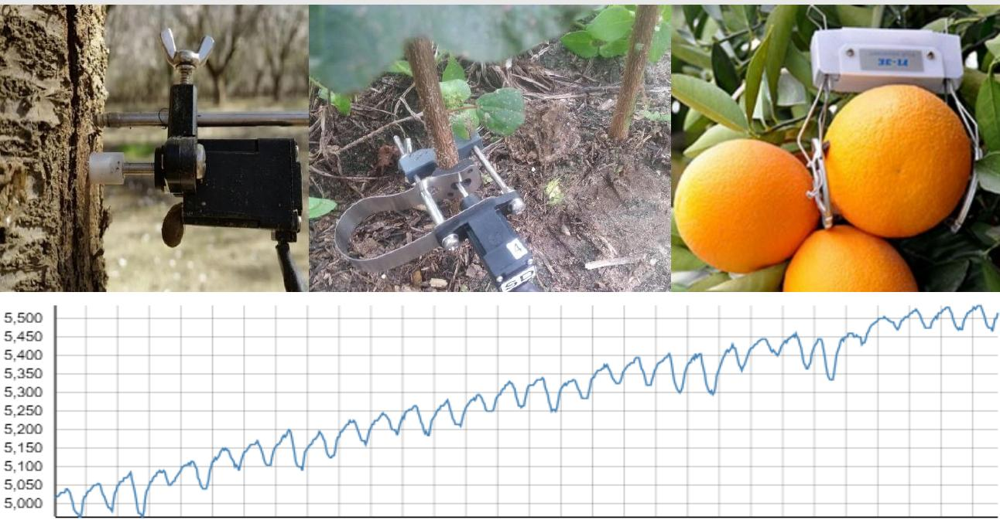
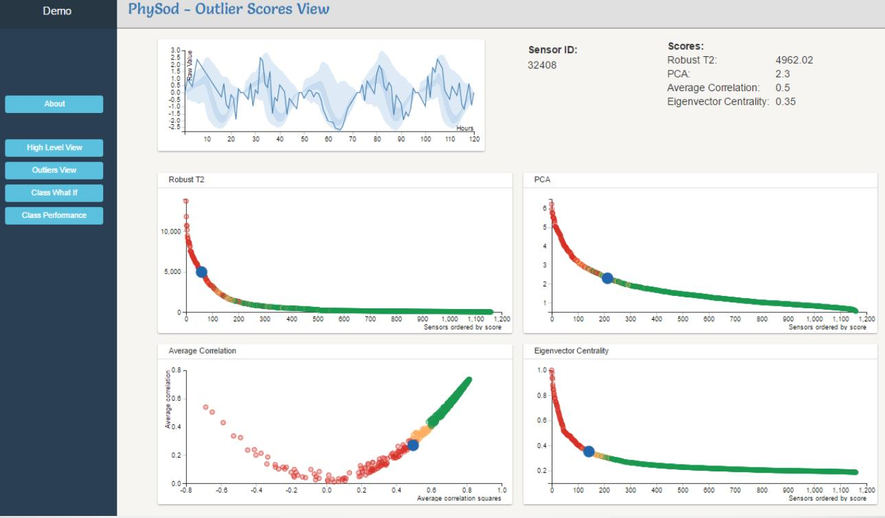

I am glad to announce our latest contribution, just publised in Computers and Electronics in Agriculture [1]. 
The described system will soon be avaialbe as an R pacakge. 

Think of rain as Irrigation 1.0; sprinklers as Irrigation 2.0; [drippers](https://en.wikipedia.org/wiki/Drip_irrigation) as 3.0. 
In Irrigation 4.0, farmers irrigate upon demand. 
To assess a plants "demand" for water, several technologies are used. 
All of these, require the assurance of the data quality that enters irrigation algorithms. 
The scale of modern fields is such that data-quality needs to be assured automatically, not manually. 

Any modern age BI system will allow data screening using If-Then rules. 
These rules may filter "technical" anomalies, but will be unable to capture "statistical anomalies" such as a sick plant, or over-reactive sensor. 

To aid agriculturers to assure data quality for demand-based irrigation, we teamed up with [Pytech](https://www.phytech.com/), a manufacturer of [dendrometers](https://en.wikipedia.org/wiki/Dendrometry) to develop a system for the detection of anomalous sensors. 

The building blocks of our system: 

1. Measure the plants' health via a network of dendrometers. 
1. Faulty sensors detected using various anomaly detection algorithms, borrowing ideas from the robust-multivariate statistics, and social-network analysis. 
1. Once an anomaly has been detected, an interrogation of the sensor is made possible in any browser, using web-technologies; [D3.JS](https://d3js.org/) in particular. 

-------------------
[1] Vilenski, Efrat, Peter Bak, and Jonathan D. Rosenblatt. "Multivariate anomaly detection for ensuring data quality of dendrometer sensor networks." Computers and Electronics in Agriculture 162 (2019): 412-421.