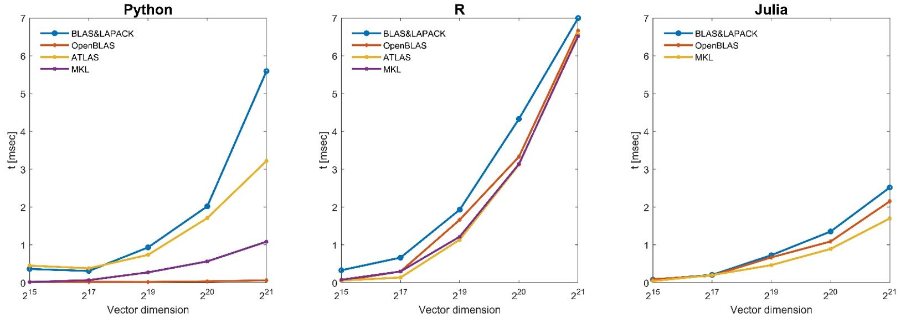
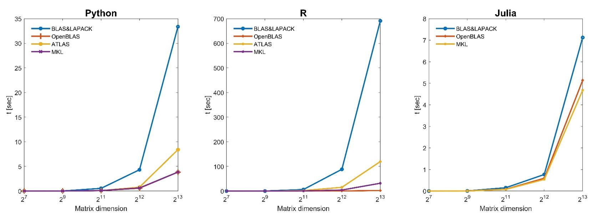
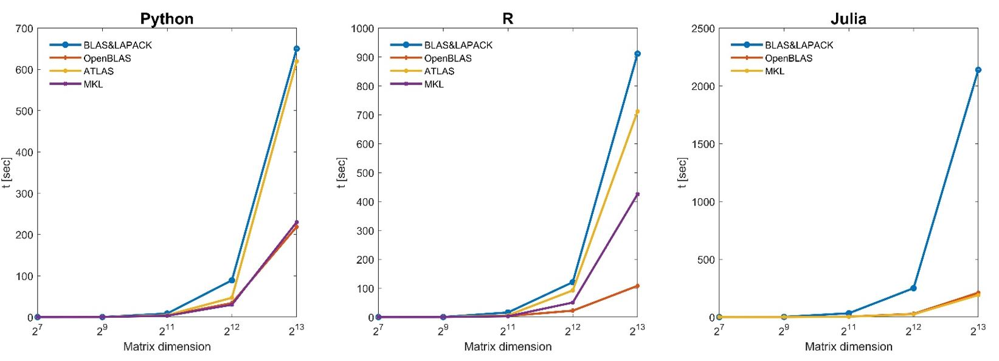
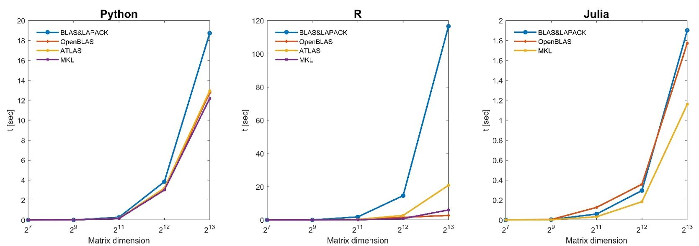
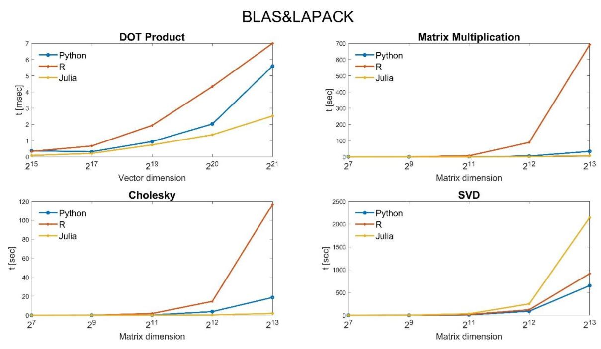
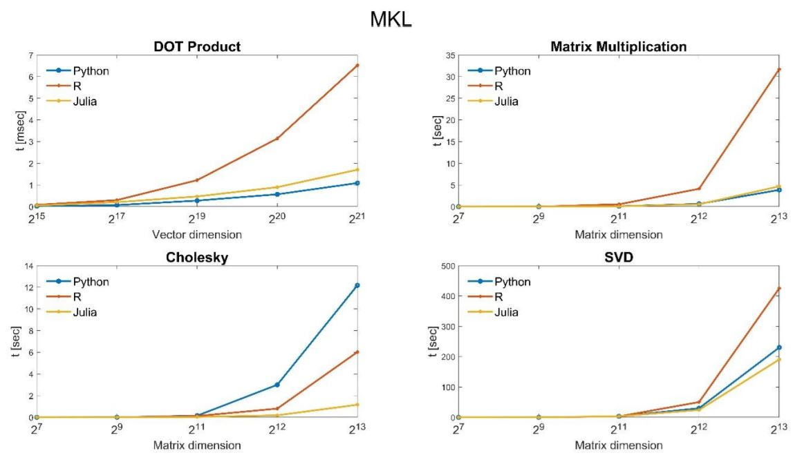
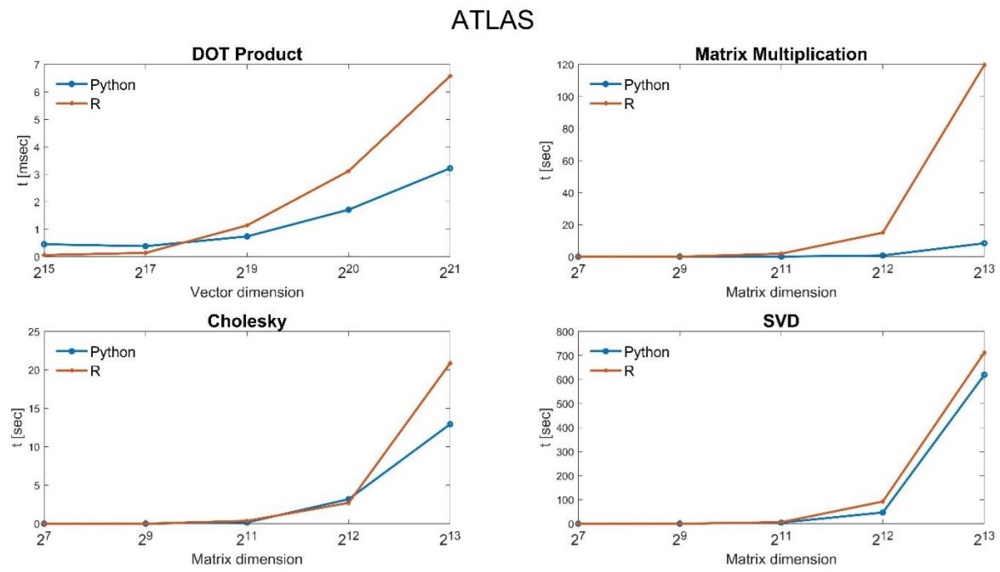
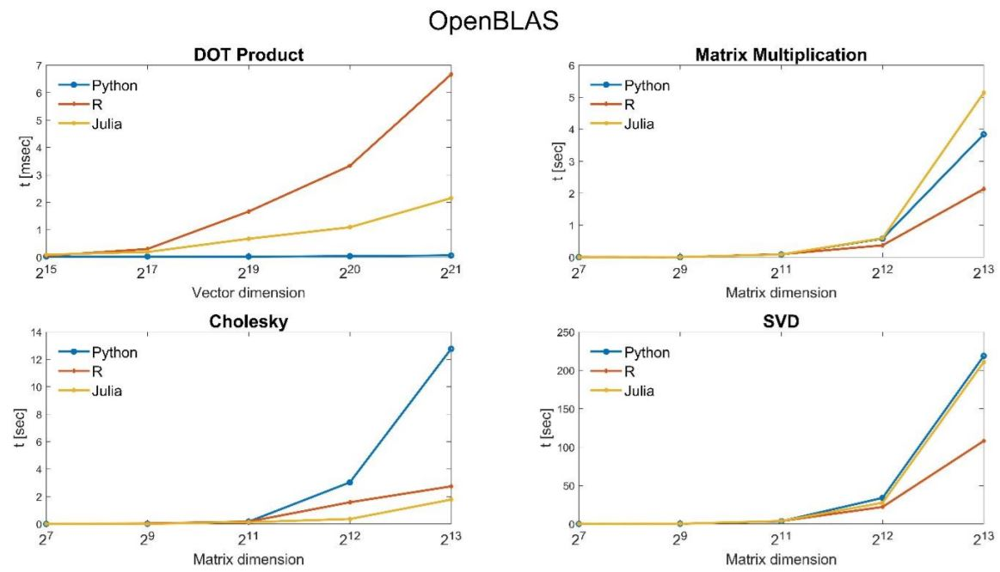

__Guest post by [Guy Barel](guybare@post.bgu.ac.il).__

Linear algebra libraries contain essential methods for statistical software. 
Machine learning and AI use numeric linear algebra operations on data sets represented as matrices and vectors, making numerical linear algebra a core component in the field. 
In recent years, the HPC community has attracted considerable research attention on obtaining high performances in matrix computations. 
In addition, the growth of database dimensions brings an urgent need for analyzing the data sets in a reasonable time. 
Therefore, knowing what the optimal libraries are in computing speed is crucial for any user interested in the field. 

The following is a benchmark I conducted during my 4-th year engineering project at BGU with the guidance of Dr. Jonathan Rosenblatt. 
The benchmark evaluates the performances of some matrix operations, in terms of execution time, for a wide range of linear algebra libraries - Basic Linear Algebra Subprograms [(BLAS)]( http://www.netlib.org/blas/), Linear Algebra Package [(LAPACK)](  http://www.netlib.org/lapack/), and high-performance libraries ([OpenBLAS]( https://www.openblas.net), [ATLAS]( http://math-atlas.sourceforge.net/), and [IntelMKL]( https://software.intel.com/content/www/us/en/develop/tools/oneapi/components/onemkl.html#gs.btl752)). 
Moreover, the libraries evaluation  is combined with three programming languages, R, Python, and Julia, offering extended analysis compared to related publications.

In order to reach optimized performance time, the combination of two main parameters are examined, $$(i)$$ the selection of a linear algebra library and $$(ii)$$ the preferred programming language.

For benchmarking purposes, it is necessary to replace the underlying BLAS implementation of a programming language, where the replacement process has been proven particularly challenging. 
For this purpose, I use a novel framework called [FlexiBLAS](https://www.mpi-magdeburg.mpg.de/projects/flexiblas) to exchange the BLAS implementation at run-time via an environment variable. 
This approach uses a wrapper library called FlexiBLAS, which neither requires relinkage nor recompilation. 
FlexiBLAS concept is a lightweight wrapper library around all BLAS and LAPACK subroutines using a plugin framework on top of the POSIX features for load, unload, and search for functions or symbols inside elf-files at runtime. 
The major advantage of this approach is the relatively simple process of exchanging the BLAS library; besides, numerical experiments show no significant overhead introduced by this approach [MartinK¨ohler2013].

For benchmarking linear algebra libraries, hardware and software aspects significantly matter for the overall results. 
The use of different CPUs, programming languages, or operating systems will generate distinct performance profiles. 
This benchmark were carried out on a 64-bit machine featuring four 16-core Intel Xeon E7-4850v4 processors at 2.1GHz 115W, 1M L1, 4M L2, and 40M 20-way set associative shared cache, a total of 64 core/ 128 threads. 
All tests will be performed on Linux OS Ubuntu 18.04, Using R, Julia, and Python programming languages. 

### Benchmark

Each benchmark experiment consists of 10 runs for a matrix of size $$2^7 , 2^9 , 2^{11} , 2^{12}$$ , and $$2^{13}$$, rows/columns, using the chosen benchmark— *Matrix-Multiplication, Singular Value Decomposition(SVD), Cholesky decomposition* and a matrix sizes of $$2^{15} , 2^{17} , 2^{19} , 2^{20}$$ , and $$2^{21}$$ for *Dot-Product* —over all the optimized BLAS implementations mentioned. 
For each test, I generated a random matrix for representing a matrix object. 
Then, I ran each operation ten times, recorded the elapsed running time, and computed an average time. 
Below are the results of the tests.

### Results

I choose to present the results in two different forms- $$(1)$$ Programming Languages oriented and $$(2)$$ Libraries oriented. 
This way, we can better understand the influences of the programming languages and the libraries, individually, on the computation time. 
Each of these plots displays results for all the available BLAS implementations, with the matrix dimension on the horizontal axis and the elapsed time in seconds on the vertical axis.

#### **Programming Languages oriented results**

#### Dot-Product results
 

*Figure 1 Dot-product results*

#### Matrix multiplication results
 

*Figure 2 Matrix multiplication results*

#### SVD results
 

*Figure 3 SVD results*

#### Cholskey results
 

*Figure 4 Cholskey results*

#### **Libraries oriented results**

*Figure 5 BLAS&LAPACK results*

 

*Figure 6 MKL results*

 

*Figure 7 ATLAS results*

 

*Figure 8 OpenBLAS results*

### Conclusion

Unsurprisingly, the standard BLAS and LAPACK are dominated by all other alternatives. 
Atlas is improving on the standard BLAS and LAPACK but is dominated by the libraries MKL and OpenBLAS that have relatively similar performance. 
Python and Julia are essentially indistinguishable and ahead of R for most of the tests. 
Surprisingly, R obtains much better results under OpenBLAS for most numerical tests and performs better computation time than Python and Julia.

This benchmark shows that greater performances can be achieved by wisely choosing the programming languages and the linear algebra libraries, significantly improving performances for linear algebra computation.

### References

[MartinK¨ohler2013] Martin K¨ohler, J. S. (2013). FlexiBLAS - A flexible BLAS library with runtime exchangeable backends.
